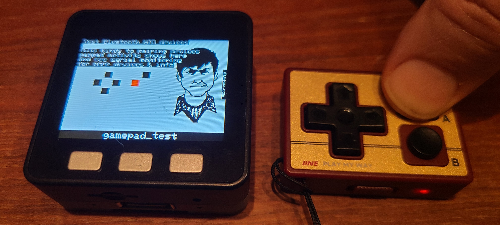

# gamepad_test



```
Test Bluetooth HID devices
    
Auto binds to pairing device
gampad activity shows here
and see serial monitoring
for more devices & info
```

This is a graphical user interface for gamepads paired via [Bluepad32](https://github.com/ricardoquesada/bluepad32) test

Targeting and tested with

|Model        |Classic Bluetooth|BLE|
|-------------|-----------------|---|
|M5Stick-C    |YES              |YES|
|M5Stick-CPlus|YES              |YES|
|M5Core Basic |YES              |YES|
|M5Core Fire  |YES              |YES|
|M5CoreS3     |NO<sup>1         |YES|
|Cardputer    |NO<sup>1         |YES|
|AtomS3       |NO<sup>1         |YES|
|AtomS3R      |NO<sup>1         |YES|

<sup>1</sup> ESP32-S3 doesn't include Classic Bluetooth support

## Also see ##

* [m5_minijoystickc_gamepad](https://github.com/davervw/m5_minijoystickc_gamepad)
